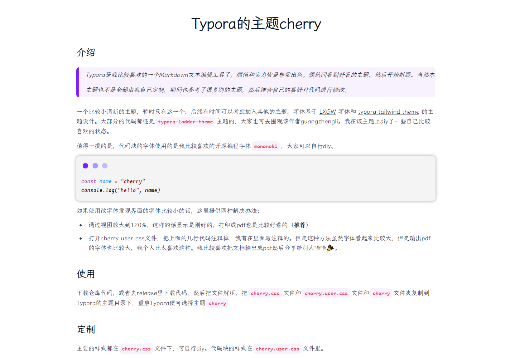

# Typora的主题cherry

## 介绍

> Typora是我比较喜欢的一个Markdown文本编辑工具了，颜值和实力皆是非常出色。偶然间看到好看的主题，然后开始折腾。当然本主题也不是全部由我自己定制，期间也参考了很多别的主题，然后结合自己的喜好对代码进行修改。

一个比较小清新的主题，暂时只有这一个，后续有时间可以考虑加入其他的主题。字体基于 [LXGW](https://github.com/lxgw/LxgwWenKai) 字体和 [typora-tailwind-theme](https://github.com/andredelft/typora-tailwind-theme) 的主题设计。大部分的代码都还是`typora-ladder-theme`主题的，大家也可去围观该作者[guangzhengli](https://github.com/guangzhengli/typora-ladder-theme)。我在该主题上diy了一些自己比较喜欢的状态。

值得一提的是，代码块的字体使用的是我比较喜欢的开源编程字体`mononoki`，大家可以自行diy。

```javascript
const name = "cherry"
console.log("hello", name)
```

如果使用改字体发现界面的字体比较小的话，这里提供两种解决办法：

+ 通过视图放大到120%，这样的话显示是刚好的，打印成pdf也是比较好看的（**推荐**）
+ 打开cherry.user.css文件，把上面的几行代码注释掉，我有在里面写注释的。但是这种方法虽然字体看起来比较大，但是输出pdf的字体也比较大，我个人比太喜欢这种。我比较喜欢把文档输出成pdf然后分享给别人哈哈🎉。

## 使用

下载仓库代码，或者去release里下载代码，然后把文件解压，把`cherry.css`文件和`cherry.user.css`文件和`cherry`文件夹复制到Typora的主题目录下，重启Typora便可选择主题`cherry` 

## 定制

主要的样式都在`cherry.css`文件下，可自行diy。代码块的样式在`cherry.user.css`文件里。

## 预览



## 致谢

重点感谢`Ladder`的作者[guangzhengli](https://github.com/guangzhengli) 、`Haru`的主题也给我很大的灵感，大家可以去围观[LSTM-Kirigaya](https://github.com/LSTM-Kirigaya/typora-haru-theme) 

还有其他一些在使用时可能给我留下印象但一时忘记的主题。

## License

```text
MIT License

Copyright (c) 2023 cc-cherry

Permission is hereby granted, free of charge, to any person obtaining a copy
of this software and associated documentation files (the "Software"), to deal
in the Software without restriction, including without limitation the rights
to use, copy, modify, merge, publish, distribute, sublicense, and/or sell
copies of the Software, and to permit persons to whom the Software is
furnished to do so, subject to the following conditions:

The above copyright notice and this permission notice shall be included in all
copies or substantial portions of the Software.

THE SOFTWARE IS PROVIDED "AS IS", WITHOUT WARRANTY OF ANY KIND, EXPRESS OR
IMPLIED, INCLUDING BUT NOT LIMITED TO THE WARRANTIES OF MERCHANTABILITY,
FITNESS FOR A PARTICULAR PURPOSE AND NONINFRINGEMENT. IN NO EVENT SHALL THE
AUTHORS OR COPYRIGHT HOLDERS BE LIABLE FOR ANY CLAIM, DAMAGES OR OTHER
LIABILITY, WHETHER IN AN ACTION OF CONTRACT, TORT OR OTHERWISE, ARISING FROM,
OUT OF OR IN CONNECTION WITH THE SOFTWARE OR THE USE OR OTHER DEALINGS IN THE
SOFTWARE.
```

